# PES-VCS — Version Control System

## 👤 Author

* **Name:** Vikas N
* **SRN:** PES2UG24CS668

---

## 📌 Project Overview

This project implements a simplified Git-like Version Control System using content-addressable storage, trees, index, and commits.

---

## ⚙️ Build Instructions

```bash
make
make test_objects
make test_tree
make test-integration
```

---

# 🔹 Phase 1 — Object Storage

## ✅ Output

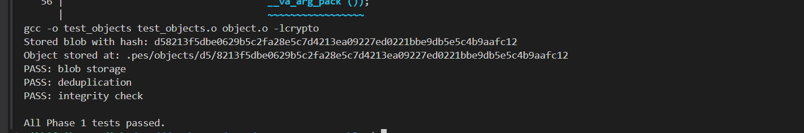

## 📁 Object Storage Structure

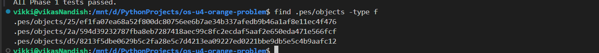

### 🧠 Explanation

* SHA-256 based storage
* Deduplication
* Integrity check

---

# 🔹 Phase 2 — Tree Objects

## ✅ Test Output

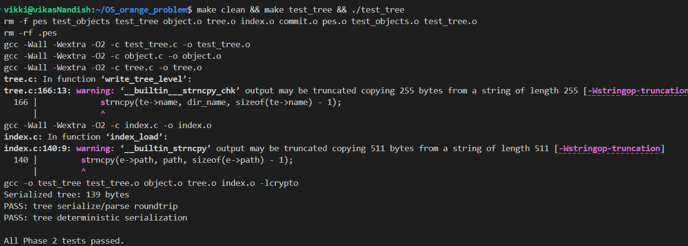

### 🧠 Explanation

* Tree = directory structure
* Deterministic serialization

---

# 🔹 Phase 3 — Index (Staging Area)

## ✅ Status Output

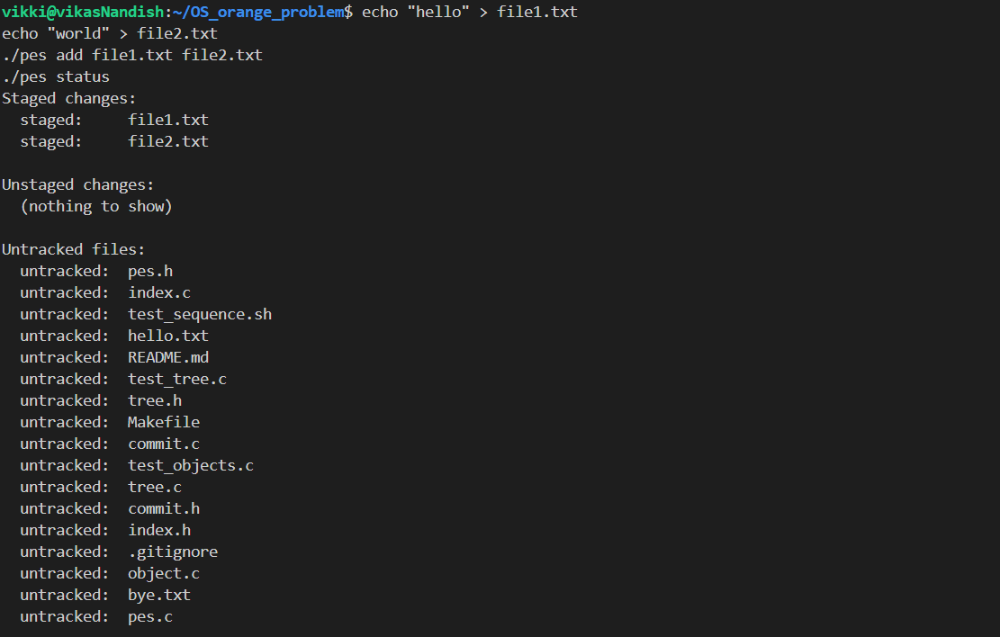

## 📄 Index File

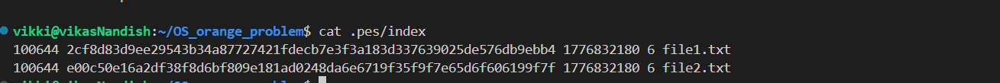

### 🧠 Explanation

* Stores staged files
* Maintains metadata

---

# 🔹 Phase 4 — Commits

## ✅ Commit Log

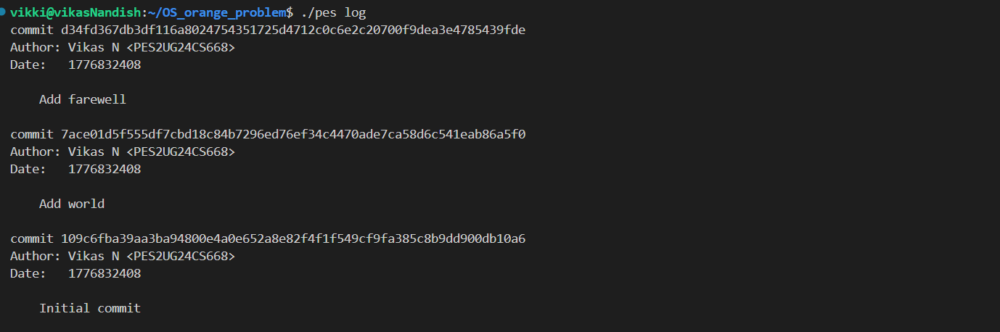

## 🔗 HEAD and References

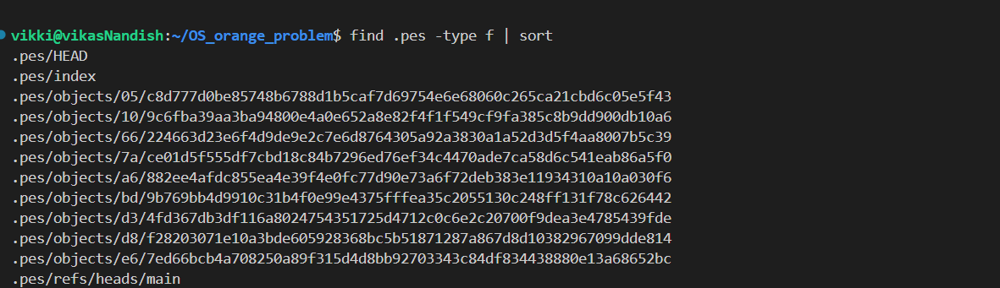
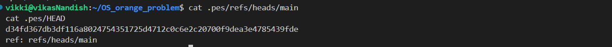


### 🧠 Explanation

* Commits store snapshots
* Linked via parent hash

---

# 🔹 Integration Test

## ✅ Output

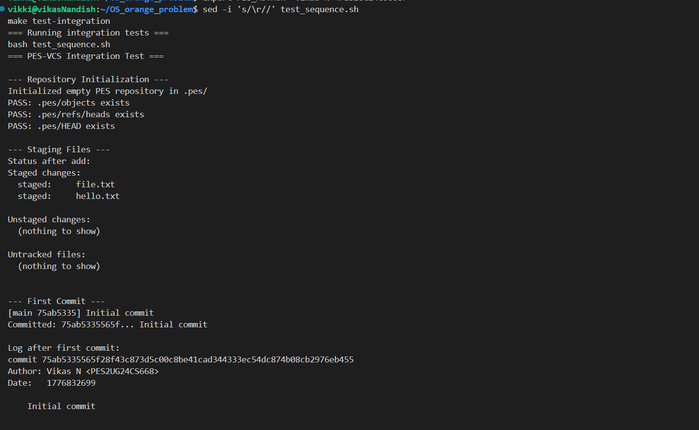
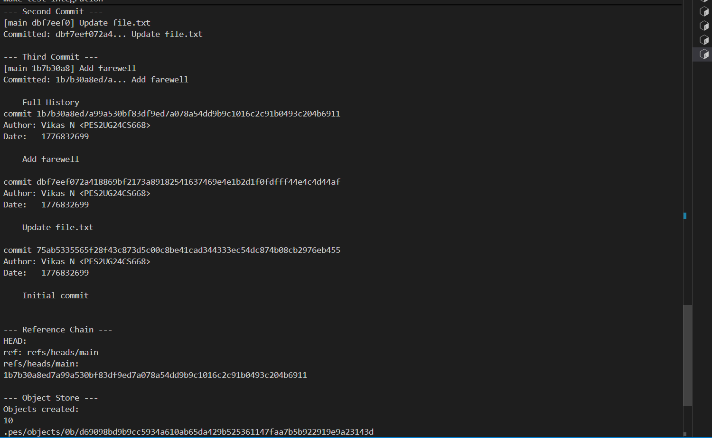
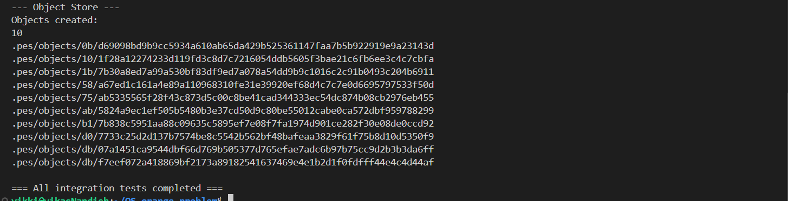

### 🧠 Explanation

* Full workflow tested successfully

---

# 📁 Files Implemented

* object.c
* tree.c
* index.c
* commit.c
* pes.c

---

# 🎯 Final Status

* ✔ All phases completed
* ✔ All tests passed
* ✔ Integration successful

---

# 📌 Conclusion

This project demonstrates the internal working of Git-like systems using hashing, trees, and commits.
